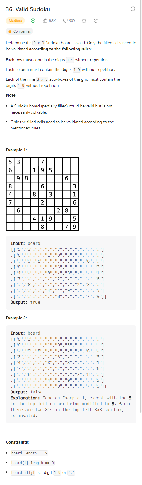
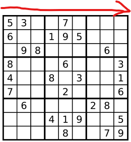
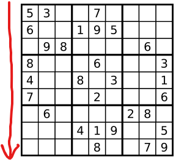
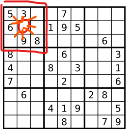
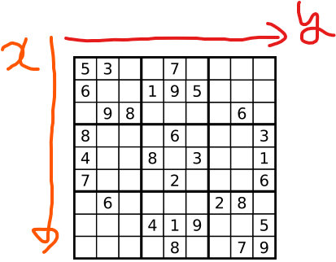
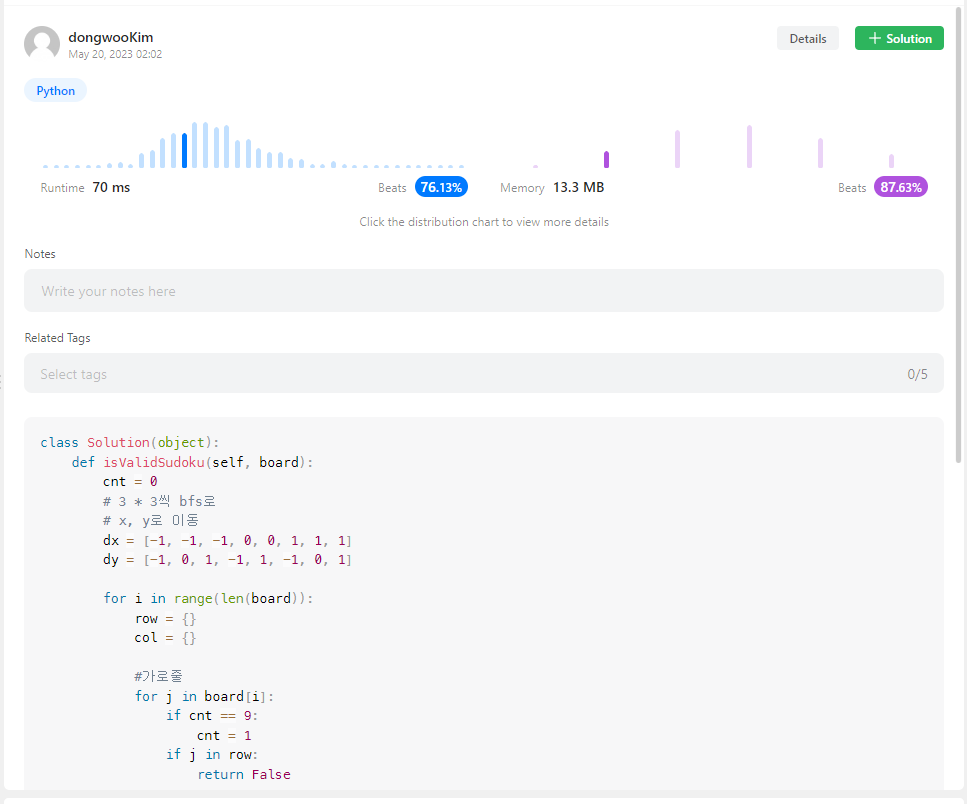
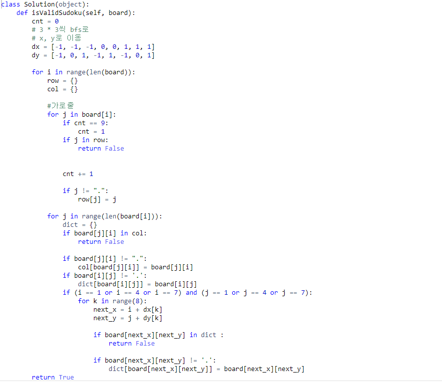

# # 🔥 Valid Sudoku - 알고리즘 문제(Leet Code)

-  
- <a href="https://leetcode.com/problems/valid-sudoku/" target="blank">Valid Sudoku 문제</a>

1. 문제 이해하기
2. 문제 접근하기
3. 문제 코드 작성하기
4. 실행하기   

## 1. 문제 이해하기

<section style="margin:40px 0">
   
  문제에서 요구하는 조건는 3가지이다, 
  <strong>첫째)</strong>&nbsp;&nbsp;가로줄 즉, 각 Row에 동일한 value가 있는지, 있으면 False 
  <strong>둘째)</strong>&nbsp;&nbsp;세로줄 즉, 각 Column에 동일한 value가 있는지, 있으면 False 
  <strong>셋째)</strong>&nbsp;&nbsp;3*3에 있는 각 cell 스도쿠에 동일한 value가 있는지, 있으면 False 
  3가지 조건을 만족하지 않을때 비로소 True를 반환하는 문제이다.
</section>

## 2. 문제 접근하기 > 문제 코드 작성하기 > 실행하기  

- ## 각각의 조건을 보면서 생각하자

  "문제를 잠시 동안보고 가로줄, 세로줄일때 각각 인덱스에 접근해서
  <strong>dictionary</strong>에 넣어가지고 있으면 그때 False를 반환 하면되겠다!"  
    
  라고 생각했다 그리고 3\*3은 어떻게 풀까 곰곰히 생각하다가 
  예전에 푼 <strong>island</strong> 문제를 응용하면 어떨까 생각이났다. 
  <strong>island</strong>를 풀때 dfs로 풀었지만 
  그때 Graph(무방향)을 생각해서 푼 기억이 있기때문이다. 
  ※무방향으로 푼것은 아래에 그림과 같이 생각해서 나타냈다.  
   

  3\*3일때 무방향이고 각각에 cell에 어떻게 들어갈까... 곰곰히 생각했다 
  큰 스도쿠를 기준으로 아래 그림과 같이 5의 좌표는 (0,0)이고 결국은 각각 
  한칸씩 마다 좌표를 가지는걸로 문제를 접근해서 풀었다. 
   

  ## 3. 되돌아보기

  해당문제는 쉬우면서도 시간복잡도를 곰곰히 생각해보고 
  어떻게 풀어야 깔끔하게 풀까?  
  생각하다가 이틀정도 걸렸다. 
  아직 미숙하고 더 많이 공부하고 해야겠고 DFS, BFS, GRAPH로 접근방법을 생각하다 이걸로 풀 수 있을까 저걸로 풀 수 있을까 생각을 많이 하게 되면
  시간이 너무 빨리 지나간다... 😓 

  (※ 밑에 코드가 짤려서 사진을 하나더 추가했습니다.)
   
   
